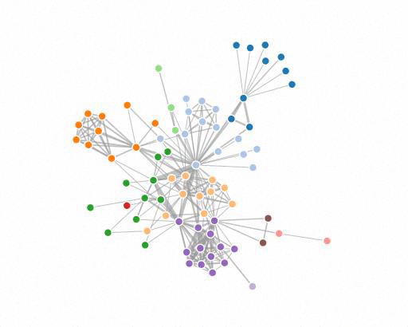
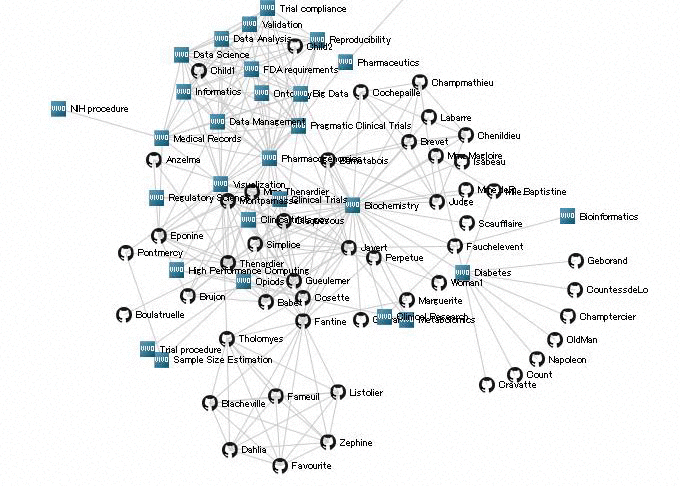
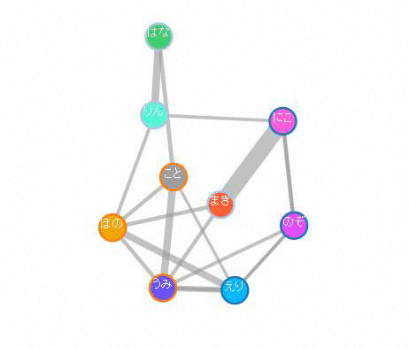

# D3.js
Data-Driven Documents (D3.js)

#Environment
This library tested on

- Firefox

#Details .....φ(･Å･´*)
###SocialGraph
default - Force-Directed Graph

hackathon - ファビコングラフ

twitter-friendship - twitterの人物関係グラフ

lovelive - loveliveの登場キャラの関係グラフ

###Chart

barchart.html - 横棒グラフ

circle.html - 円のD3.js表示練習

columnchart.html - 縦棒グラフ

index.html - update(),enter(),exit()の領域概念

Ronbun.html - 縦棒グラフ

Ronbun_animation.html - アニメーション付き縦棒グラフ

#Author
Fumihiko Akagi

#Copyright
    The MIT License

    Copyright (c) 2015 Fumihiko Akagi

    Permission is hereby granted, free of charge, to any person obtaining a copy of this
    software and associateddocumentation files (the "Software"), to deal in the Software
    without restriction, including without limitationthe rights to use, copy, modify, merge,
    publish, distribute,sublicense, and/or sell copies of the Software,and to permit persons
    to whom the Software is furnished to do so, subject to the following conditions:

    The above copyright notice and this permission notice shall be included in all copies or 
    substantial portions of the Software.

    THE SOFTWARE IS PROVIDED "AS IS", WITHOUT WARRANTY OF ANY KIND, EXPRESS OR IMPLIED, 
    INCLUDING BUT NOT LIMITED TO THE   WARRANTIES OF MERCHANTABILITY, FITNESS FOR A
    PARTICULAR PURPOSE AND NONINFRINGEMENT. IN NO EVENT SHALL THE A UTHORS OR COPYRIGHT
    HOLDERS BE LIABLE FOR ANY CLAIM, DAMAGES OR OTHER LIABILITY, WHETHER IN AN ACTION OF
    CONTRACT, TORT OR OTHERWISE, ARISING FROM, OUT OF OR IN CONNECTION WITH THE SOFTWARE
    OR THE USE OR OTHER DEALINGS IN THE SOFTWARE.
