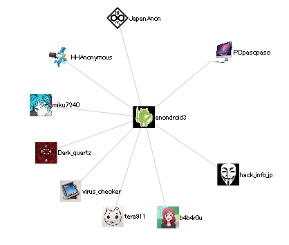
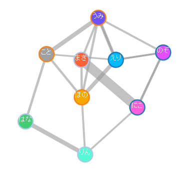
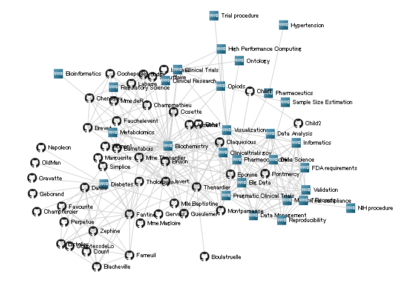
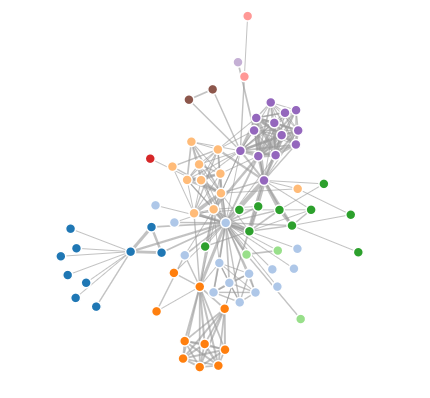

# D3.js
Data-Driven Documents (D3.js)

#Environment
This library tested on

- IE
- Firefox
- Safari

#Details .....φ(･Å･´*)
###SocialGraph
twitter-friendship - twitterの人物関係グラフ

lovelive - loveliveの登場キャラの関係グラフ

haccason - ファビコングラフ(haccasonで作成)

default - Force-Directed Graph

###Chart

barchart.html - 横棒グラフ

circle.html - 円のD3.js表示練習

columnchart.html - 縦棒グラフ

index.html - update(),enter(),exit()の領域概念

Ronbun.html - 縦棒グラフ

Ronbun_animation.html - アニメーション付き縦棒グラフ

#Author
Fumihiko Akagi

#Copyright
BSD License
